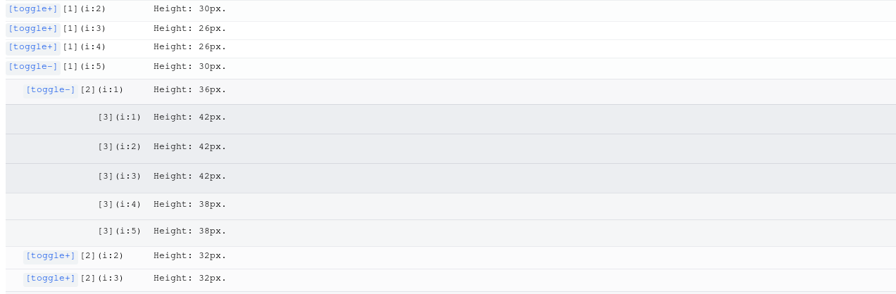

### Temat zadania
Wykorzystując OpenChargeMap wyświetlić ładowarki prądu przemiennego w Polsce w formie drzewa o 3 poziomach zagnieżdżenia. W zadaniu należy uwzględnić implementację front-endu w React.JS oraz komunikację z API.

### Opis zadania
- __Komunikacja z API__: Pobranie 300 punktów z OpenChargeMap w Polsce i ograniczenie gniazd ładujących w każdym z punktów do jednego (connector[0]) → obecnie zdarzają się sytuacje, gdy w jednym punkcie ładującym znajduje się kilka wtyczek do ładowania o różnych mocach. Informacje dla kolejnych konektorów (1+) w każdej ze stacji można w tym zadaniu pominąć.
Dane te muszą być następnie pogrupowane najpierw w kontekście miast, a następnie mocy.

Przykładowy URL do zapytania API to: <https://api.openchargemap.io/v3/poi/?output=json&countrycode=PL&maxresults=300&compact=true&verbose=false>

- __UI__: Dane powinny zostać wyświetlone w formie drzewa z możliwym rozwijaniem opcji. Przykład biblioteki, z której można skorzystać <https://constantin-p.github.io/cp-react-tree-table/>

  - __Pierwszy poziom__ drzewa to podział punktów na miasta. W tym zadaniu wystarczy użyć 18 stolic województw.
  - __Drugi poziom__ drzewa to podział punktów ze względu na moc ładowania. Podział ten można ograniczyć do 4 zakresów:
    - ≤ 3,7 kW
    - 3,7 kW < moc ≤ 11 kW
    - 11 kW < moc
    - nieznana moc
  - __Trzeci poziom__ to lista z punktami ładowania. Po kliknięciu w konkretną nazwę pojawiają się szczegóły tego punktu ładowania, które podzielić można na dwa widoki. Pierwszy, domyślny widok pokazuje się od razu po kliknięciu w pojedynczy punkt. Przedstawia podstawowe informacje o punkcie ładowania. W widoku tym dostępny jest przycisk "więcej". Po kliknięciu w ten przycisk, pojawia się drugi widok, zastępujący pierwszy, który wyświetla informacje dodatkowe. Zmianie tej powinna towarzyszyć dowolna animacja przejścia, np. rotateX().

### Struktura drzewa ładowarek
- Miasto - stolice województw
  - Moc ładowania - 4 progi
    - Szczegóły pojedynczego punktu ładowania:
      1. Podstawowy widok:
        - Location Detail
        - Usage restrictions
        - Equipment Detail
      2. Widok po kliknięciu przycisku "więcej":
        - Network/Operator
        - Additional Information

### Dodatkowe informacje
W repozytorium dostępny jest plik konfiguracyjny ESLint oraz Komponent potencjalnie do wykorzystania w szczegółach ładowarki (src_export.zip) (część scss jest importowana jak css modules, a część nie.). Wykorzystanie tych elementów jest opcjonalne.

__Jako rozwiązanie należy przesłać kod oraz krótką instrukcję uruchomienia.__

__Powodzenia!__
